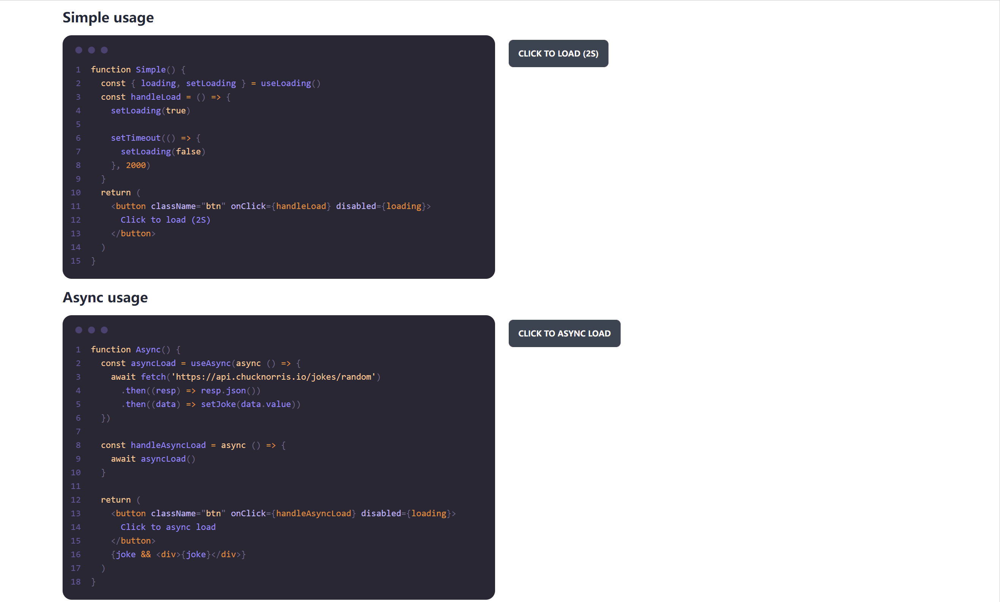

# react-loading

[](https://github.com/rexcape/react-loading/actions/workflows/main.yml)

A loading state provider for react. It will show the given component while loading is `true`

WARNING: **This repo will not provide ui components, it only provides hooks and methods I usually use**



## motivation

I need to use the loading state for many projects. However, I can't find a suitable library from npm, so I created this repo as a temporary solution. I believe I will find a better library later, so this repo will not published to npm.

My implementation is from [this anwser on stackoverflow](https://stackoverflow.com/a/69110667)

If you care about the size of bundle very much, feel free to copy or modify the [index.tsx](./src/index.tsx) to your file, or find other library(I can't find...).

## usage

### install

- `npm install github:rexcape/react-loading`
- `yarn add github:rexcape/react-loading`
- `pnpm install github:rexcape/react-loading`

### initial settings

Create a loading component(here uses [tailwindcss](https://tailwindcss.com/) and [@uiball/loaders](https://uiball.com/loaders/))

```tsx
import { Ring } from '@uiball/loaders'

export function LoadingComponent() {
  return (
    <div className="fixed inset-0 bg-black bg-opacity-50 z-40">
      <div className="flex min-h-full items-center justify-center">
        <Ring size={80} lineWeight={5} speed={2} color="#eee" />
      </div>
    </div>
  )
}
```

Set a provider with component

```tsx
import React from 'react'
import ReactDOM from 'react-dom/client'
import App from './App'
import { LoadingProvider } from 'react-loading'
import { LoadingComponent } from './LoadingComponent'
import './index.css'

ReactDOM.createRoot(document.getElementById('root')!).render(
  <React.StrictMode>
    <LoadingProvider component={<LoadingComponent />}>
      <App />
    </LoadingProvider>
  </React.StrictMode>
)
```

## example

### simple

```tsx
import { useLoading } from 'react-loading'

function SimpleExample() {
  const { loading, setLoading } = useLoading()
  const handleLoad = () => {
    setLoading(true)

    setTimeout(() => {
      setLoading(false)
    }, 2000)
  }
  return (
    <button className="btn" onClick={handleLoad} disabled={loading}>
      Click to load (2S)
    </button>
  )
}
```

### async

```tsx
import { useAsync } from 'react-loading'

function AsyncExample() {
  const asyncLoad = useAsync(async () => {
    await fetch('https://api.chucknorris.io/jokes/random')
      .then((resp) => resp.json())
      .then((data) => setJoke(data.value))
  })

  const handleAsyncLoad = async () => {
    await asyncLoad()
  }

  return (
    <button className="btn" onClick={handleAsyncLoad} disabled={loading}>
      Click to async load
    </button>
    {joke && <div>{joke}</div>}
  )
}
```
